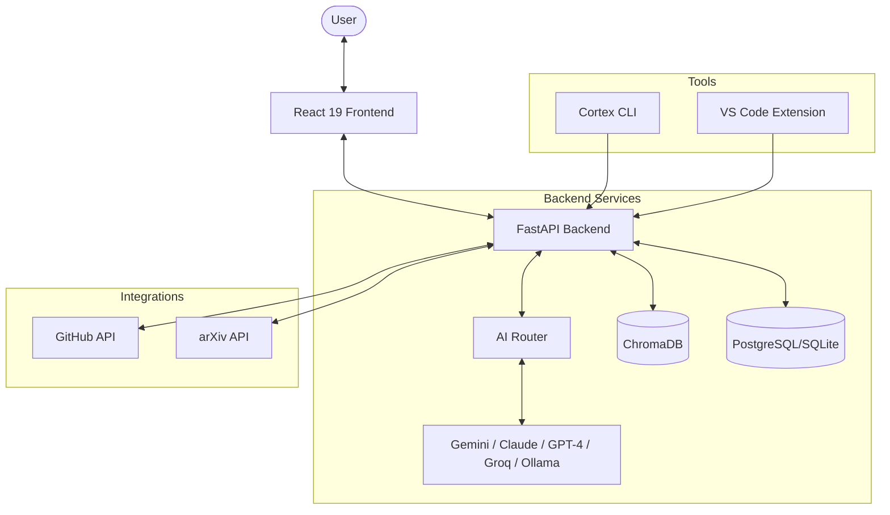

# Cortex Evaluator

[](https://opensource.org/licenses/MIT)
[](https://fastapi.tiangolo.com)
[](https://react.dev)

Cortex Evaluator is a comprehensive AI-powered platform designed to transform development workflows. It emulates cognitive processing to bridge the gap between high-level research (like arXiv papers), brainstorming ideation, and production-ready code through automated evaluations and Change Request (CR) generation.

## 🚀 Features

### Phase 1: Core Infrastructure
- **Multi-Provider AI Router**: Intelligent routing between OpenAI, Anthropic, Gemini, Groq, and local Ollama models.
- **Circuit Breaker Pattern**: Ensures high availability by falling back to alternative providers during outages.
- **Persistent Storage**: Full session and project persistence using SQLite/PostgreSQL.

### Phase 2: Enhanced Input Sources
- **arXiv Integration**: Search and analyze academic papers directly against your codebase.
- **Web Content Extraction**: Extract clean technical context from any URL.
- **Multi-format Support**: Import code via GitHub, local folders, snippets, or PDFs.

### Phase 3: Brainstorming & Ideation
- **Brainstorming Canvas**: Interactive React Flow-based mind mapping tool for architectural planning.
- **AI-Assisted Ideation**: Generate solution nodes, expand problems, and analyze relationships between ideas.

### Phase 4: Advanced CR Generation
- **Structured Change Requests**: Detailed technical specs with task breakdowns and complexity estimations.
- **Template System**: Export CRs optimized for Claude Code, Jira, GitHub Issues, or Linear.

### Phase 5: Session & History
- **Project Workspaces**: Organize evaluations and brainstorms into logical workspaces.
- **Semantic Search**: Find past evaluations and related context using ChromaDB vector search.

### Phase 6: Ecosystem Integration
- **CLI Tool**: Command-line interface for CI/CD integration and terminal-based analysis.
- **VS Code Extension**: Direct access to evaluations and CR generation within the editor.

## 🏗️ Architecture



## 🛠️ Quick Start

### Prerequisites
- **Node.js**: v20 or higher
- **Python**: 3.10 or higher
- **Docker**: For containerized deployment

### Installation

1. **Clone the repository**:
   ```bash
   git clone https://github.com/your-org/cortex-evaluator.git
   cd cortex-evaluator
   ```

2. **Backend Setup**:
   ```bash
   cd backend
   python -m venv venv
   source venv/bin/activate  # Windows: venv\Scripts\activate
   pip install -r requirements.txt
   cp .env.example .env
   # Add your API keys to .env
   ```

### Running Locally

#### Go WebUI (Recommended)
The new embedded Go webui provides a single-binary deployment with all features:

```bash
# Build
go build -o /tmp/webui ./cmd/webui

# Run (default port 8080)
/tmp/webui

# Or specify a custom port
PORT=3000 /tmp/webui
```

Then visit `http://localhost:3000` (or `http://localhost:8080`)

**Features:**
- Single binary, no external dependencies
- File browser for project selection
- Multi-provider LLM support (OpenAI, Anthropic, Gemini, Groq, Ollama)
- GitHub repository evaluation with Cortex First Principles
- Session management with New Chat functionality
- Light/Dark theme

#### Using Docker
```bash
docker-compose up --build
```
- WebUI: `http://localhost:3000`
- Backend API: `http://localhost:8000`

#### Legacy Frontend (Deprecated)
> **Note**: The React frontend in `frontend/` is deprecated. Use the Go webui above instead.

```bash
# Only for reference - not recommended
cd frontend
npm install
npm run dev  # Runs on port 5173
```

## 📄 Documentation

- [Deployment Guide](DEPLOYMENT.md) - Production and Docker setup
- [API Documentation](API.md) - Complete endpoint reference
- [Frontend Guide](FRONTEND.md) - React architecture and components
- [Backend Guide](BACKEND.md) - FastAPI and AI services
- [Contributing](CONTRIBUTING.md) - How to help improve Cortex Evaluator

## 🤝 Contributing

We welcome contributions! Please see our [Contributing Guidelines](CONTRIBUTING.md) for details on our code of conduct and the process for submitting pull requests.

## ⚖️ License

This project is licensed under the MIT License - see the [LICENSE](LICENSE) file for details.
